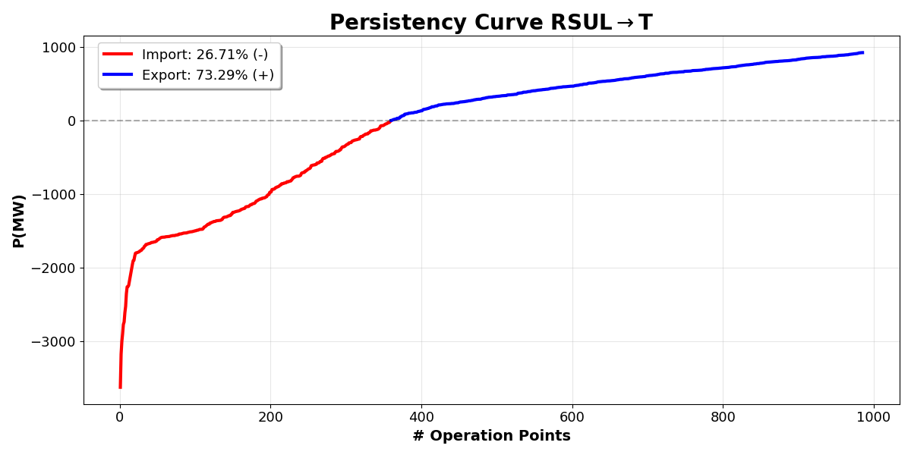
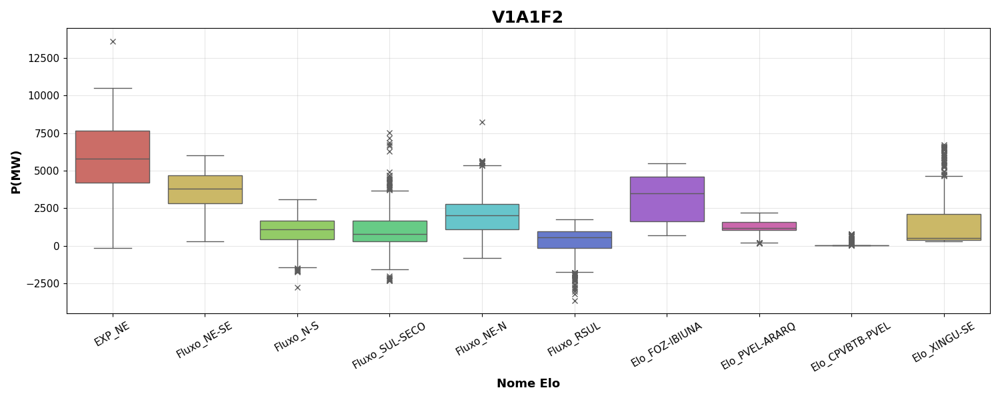
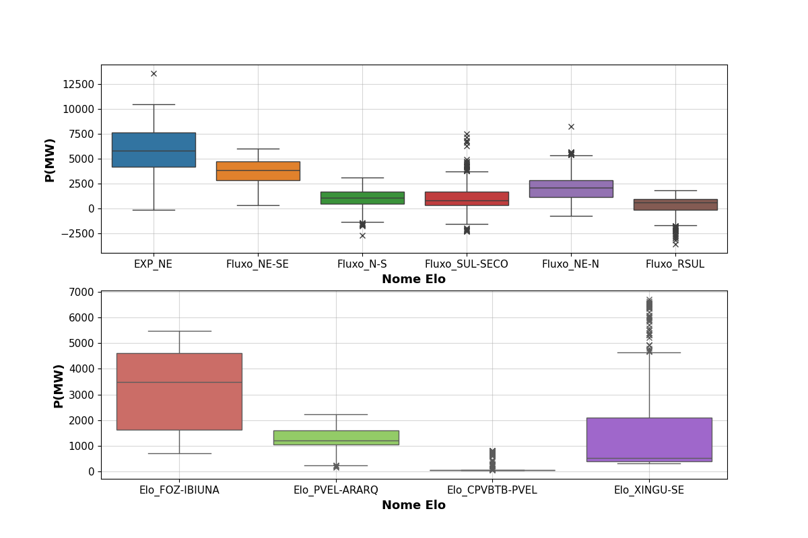
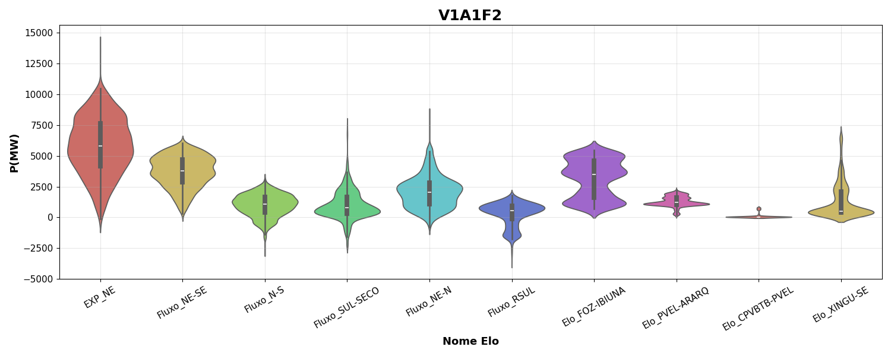
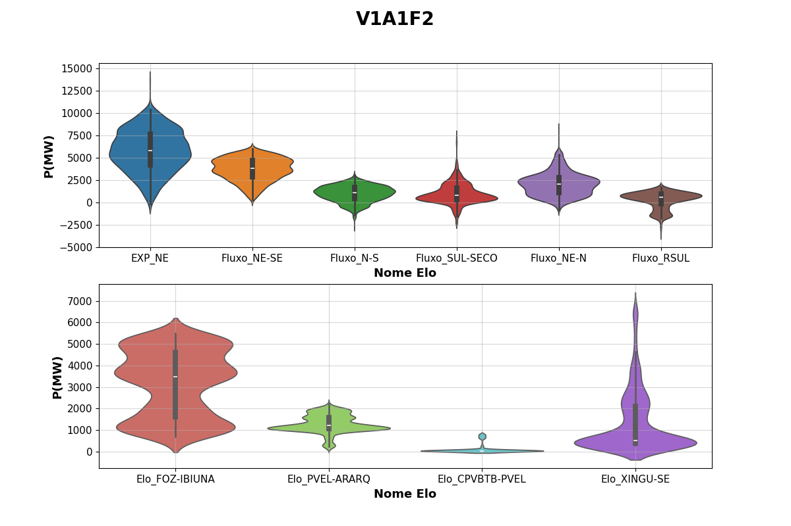
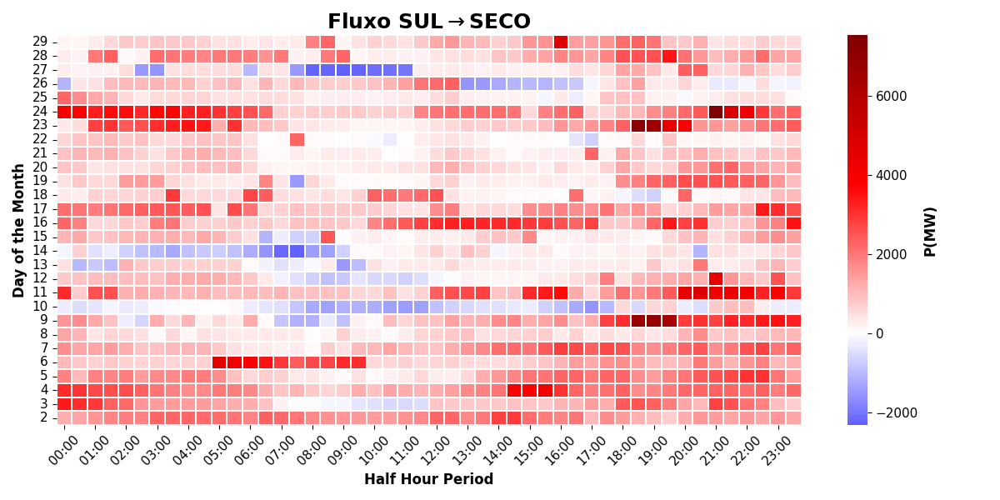
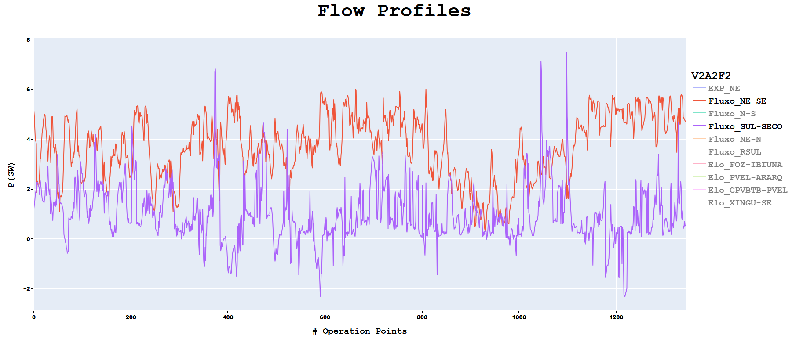
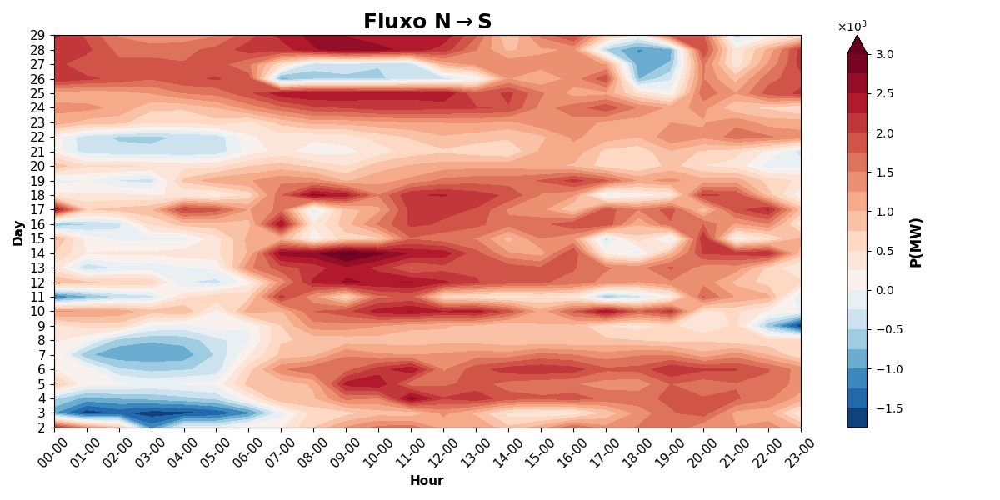

# Engie Project

<!-- - Persistency Curves
- Box Plots
- Violin Plots
- Heatmaps
- Contour Plots
- Flow Profiles -->

## Persistency Curves
It is observed the amount of operations points where the power flow is positive (blue), meaning that power is being exported and negative (red), where power is being imported.

### Parameters:
    - dataset=df_pwf        # Input dataset  (necessary)            
    - col='P(MW)'           # Name of column to plot (necessary)
    - k = 0                 # Index of Interconnection (0-9) (necessary)
    - path=path             # Path to save plot (optional)
    - ax_fontsize=13        # Size of axes (optional)

## Box Plots
### Parameters:
    - dataset=df_pwf        # Input dataset  (necessary)
    - col='P(MW)'           # Name of column to plot (necessary)
    - split_flows=False     # 0: 1 plot | 1: splitted plot (necessary)
    - path=path             # Path to save plot (optional)      
    - ax_fontsize=11        # Manage size of axes (optional)
    - scenario='V1A1F2'     # Name of title or scenario (optional)

#### split_flows=False

#### split_flows=True

## Violin Plots
### Parameters:
    - dataset=df_pwf        # Input dataset  (necessary)
    - col='P(MW)'           # Name of column to plot (necessary)
    - split_flows=True      # 0: 1 plot | 1: splitted plot (necessary)
    - path=path             # Path to save plot (optional)      
    - ax_fontsize=11        # Manage size of axes (optional)
    - scenario='V1A1F2'     # Name of title or scenario (optional)

#### split_flows=False

#### split_flows=True

## Heatmaps
### Parameters
    - dataset=df_pwf        # Input dataset  (necessary)            
    - col='P(MW)'           # Name of column to plot (necessary)
    - k = 0                 # Index of Interconnection (0-9) (necessary)
    - path=path             # Path to save plot (optional)
    - ax_fontsize=13        # Size of axes (optional)

## Flow Profiles
It outputs a HTML file that can be opened with any browser (preferable Chrome), and plots the flow profiles, having at the beginning a blank plot, but clicking the flows specified in the LEGEND of the plot, these can be shown.

### Parameters
    - dataset=df_pwf        # Input dataset  (necessary)            
    - col='P(MW)'           # Name of column to plot (necessary)
    - scenario="V2A2F2"     # Name of scenario to put on LEGEND (necessary)
    - path=path             # Path to save the html (optional)

## Contour Plots
### Parameters
    - dataset=df_pwf        # Input dataset  (necessary)            
    - col='P(MW)'           # Name of column to plot (necessary)
    - k = 0                 # Index of Interconnection (0-9) (necessary)
    - path=path             # Path to save plot (optional)
    - ax_fontsize=13        # Size of axes (optional)

